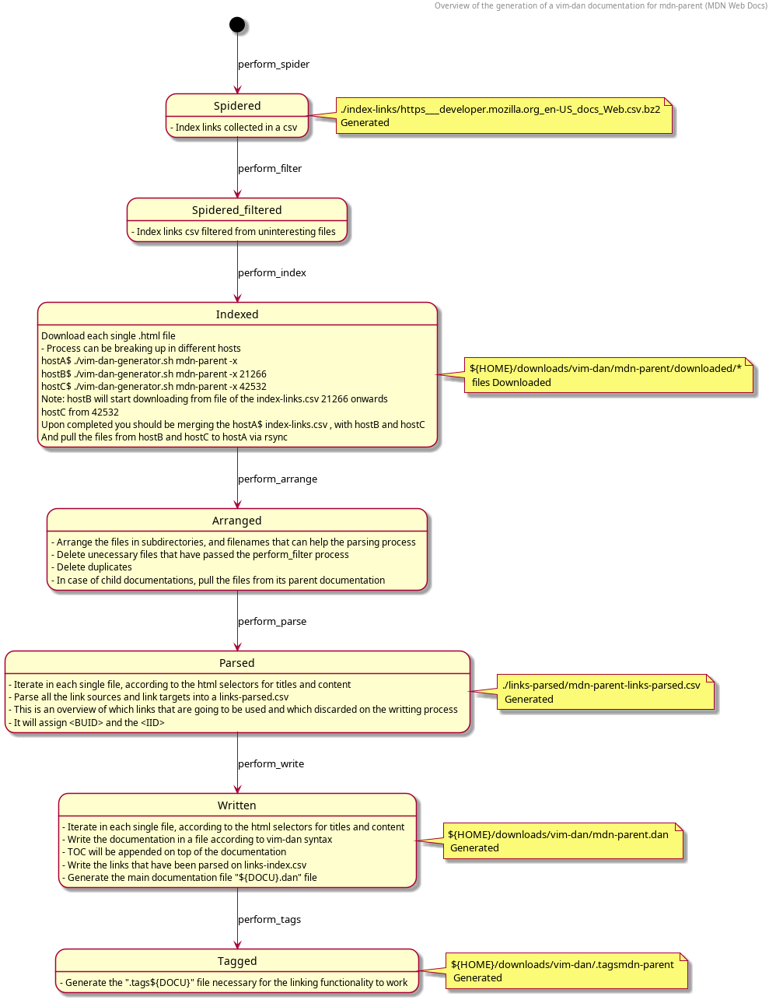

# vim-dan-generator

Generator of .dan files in use on vim's plugin vim-dan


# Dependencies

```
npm install puppeteer-core csv-parser json2csv commander unbzip2-stream
# Universal ctags build from source
# https://github.com/universal-ctags/ctags
```

## Limitations

- You can place highlight ticks `(X)` in any line of the document except on the Block Link Targets as it will break their functionality.

The following is wrong
```
<B=3hj>/myNotes/Packages_I_use.html (X)

& Packages I use&
``` 
The following is good

```
<B=3hj>/myNotes/Packages_I_use.html

& Packages I use& (X)
```

## Documentation generation diagram




## Pending documentations

- https://www.perl.org/
https://perldoc.perl.org/
- sql
- https://plantuml.com/

## Pending functionalities

- Create a - My Notes  section in the - TOC , which the user can add user made notes
    
For instance considering the following

```
- Welcome to the Adobe Illustrator Scripting Guide!
- introduction
  - Changelog
  - Executing Scripts
  - Scripting language support in Adobe Illustrator CC
  - Viewing Sample Scripts
  - Viewing the object model
- myNotes

```

Upon appending new pages below and processing it  they will get appended on the documentation as if a new `.html` page has been parsed


```
- Welcome to the Adobe Illustrator Scripting Guide!
- introduction
  - Changelog
  - Executing Scripts
  - Scripting language support in Adobe Illustrator CC
  - Viewing Sample Scripts
  - Viewing the object model
- My Notes
  - Packages I use
```

Then at the bottom this will be created


```
=========================================================================================================
<B=3hj>/myNotes/Packages_I_use.html

& Packages I use&
 ____            _                           ___                   
|  _ \ __ _  ___| | ____ _  __ _  ___  ___  |_ _|  _   _ ___  ___  
| |_) / _` |/ __| |/ / _` |/ _` |/ _ \/ __|  | |  | | | / __|/ _ \ 
|  __/ (_| | (__|   < (_| | (_| |  __/\__ \  | |  | |_| \__ \  __/ 
|_|   \__,_|\___|_|\_\__,_|\__, |\___||___/ |___|  \__,_|___/\___| 
                           |___/                                   

=========================================================================================================
```

If you add a Link it will be downloaded and parsed according to a header rule and a body rule

```
  - Viewing the object model
- My Notes
  - Packages I use
    - https://thebestmotherfucking.website/ -f "h1" -b "body"
```

Which upon added will become

```
  - Viewing the object model
- My Notes
  - Packages I use
    - The best motherfucking website
```

And will add its corresponding website parsed


## Hyperlink system


One of the main feature of `.dan` files are the way you can navigate from within its documents. 
One documentation is made of a dump of files (.html normally) into one single document, with its intent to be opened on `vim`. Once opened the file is full of links which take you to one part of the document or other, it lets you navigate quickly from Object to object, topic, articles, whatever you may find in such a documentation.

The main objective of this system was that the document was readable when using the file inside `vim` or by opening it with any other editor. So the links have to be as short as possible , but this functionality gets hidden from the end user in `vim` by using the feature `conceal` in a way similar to `vimhelp` documents.

### Anatomy of the hyperlinks

At its root, there are 2 types of links:

- Link Source
- Link Target

For the user positioning the cursor on any `linkSource` Pressing `Ctrl + ]` will take him/her to the `linkTarget`


#### Link Targets

They are the destination of the link, the end-point. There are two types of them:
- In-line link target
- Block link target

##### In-line Link Target

In-line they may appear many in one line, while the block ones they take up a whole line.

The following is the form of an In-line Link Target

```
<I=${IID}>
```
*IID* stands for **Inline ID** and it is normally made of no more than 2 alphanumeric characters (lower-upper)
For instance in a document we may find:

```
<I=7j><I=l2>
```


##### Block Link Target

The Block Link Target may take up one entire line and is of the form

```
<B=${BUID}>${TAGET_LABEL}
```

*BUID* stands for **Block Unique ID** and it is normally made of no more than 3 alphanumeric characters.  These are unique within the whole `.dan` document.
*TARGET_LABEL* is a human readable Unique identifier, but is longer, it may be the relative Path of the file pertaining a section of the documentation that has been parsed, but it can be anything different.

For example

```
<B=b7A>/introduction/executingScripts.html
```


#### Link Sources

They are the starting point of the cursor before the link functionality gets triggered that take you to the Link Target.

Categorizing by it's destination they can be categorized as *Block Link Source* or *In-line Link Source* , they are similar and they both can appear on the same line.

##### Block Link Source

```
<L=${BUID}>${LABEL}</L>
```

*BUID* the **Block Unique ID** that the link is pointing to
*LABEL* a Meaningful human readable string that will be shown to the user

Example

```
<L=b7A>Executing Scripts</L>
```

##### In-line Link Source

```
<L=${BUID}#${IID}>${LABEL}</L>
```

*IID* the **Inline ID** that the link is pointing to

Example

```
<L=b7A#7j>One useful script</L>
```


### The inner functionning of the system


As the `.dan` documents are normally made of a dump of different `.html` documents headed by an interactive (TOC) Table of Contents. For each .html document that gets parsed , it will generate a new **Block Link Target** which can be accessed via this TOC which is full of **Block Link Sources**.
At the same time these .html documents may have links themselves pointing to each others documents, they get parsed too as **Block Link Sources**. 
At the time a **Block Link Target** gets parsed it creates a **BUID** in order to assist the hyperlink functionality by shortening to a most meaningful string of alphanumeric characters.
The **Block Link Targets** can be targeted too by their **TARGET_LABEL**

Additionaly some Documentations may have Anchor links, pointing to other areas from within each .html document themselves, in this case these get parsed as **Inline Link Targets** , and these generate a **IID** Which is only unique within that .html Section, but not the whole `.dan` document.


### Advantages of this system. 


The usage of **BUID** letted us program with a minimal character overhead a link functionality, this way we can parse documents adding many Link Sources on the same lines which quickly get processed to the Link Target.
Both Link Sources and Link Target are all processed at the end of the `vim-dan` parsing process checking if they have at least one correspondent pair, if not they are deleted *Link Garbage Collector*

As additional Notes within the documentation may get added with the `myNotes` functionality, the user is going to be able to add Manually Link Sources, and some Link Targets, then it makes sense to keep the **TARGET_LABEL** as a humanly readable Unique Label.


